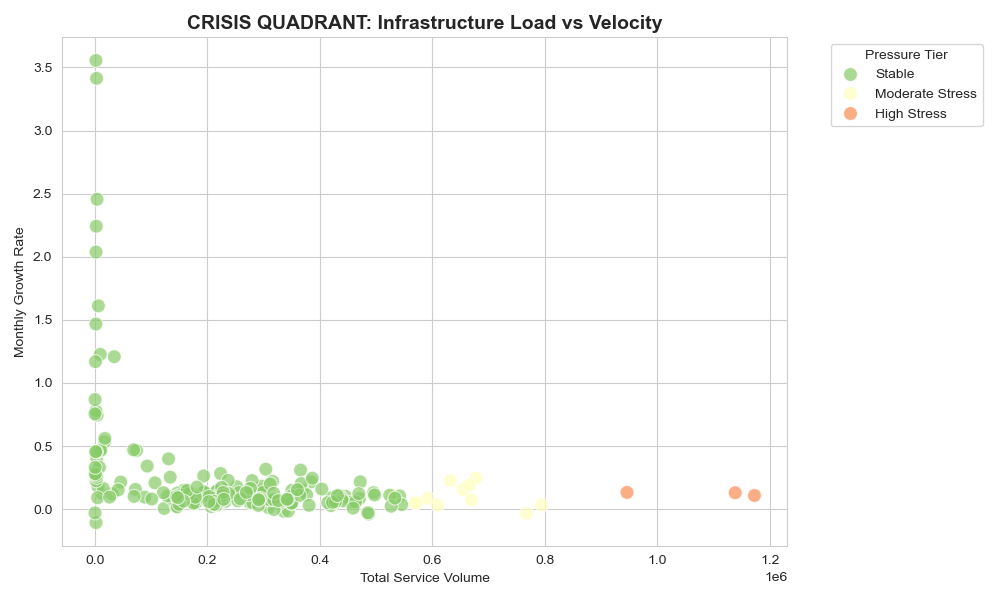
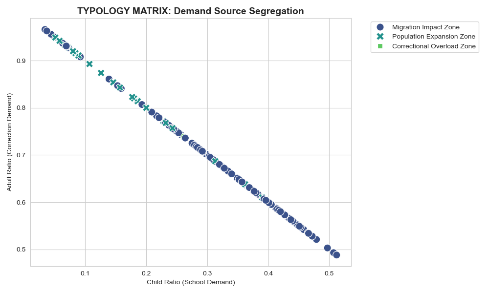
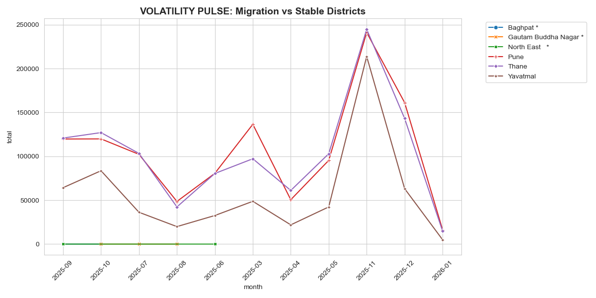

# NATIONAL INTELLIGENCE BRIEF
## AADHAAR SERVICE DEMAND INTELLIGENCE & INFRASTRUCTURE PRESSURE INDEX

**NAME:** SAJAL VIJAYVARGIYA
**TO:** UIDAI STRATEGY UNIT / NITI AAYOG  
**FROM:** DATA SCIENCE INTELLIGENCE LEAD  
**DATE:** JANUARY 15, 2026  
**SUBJECT:** TRANSITIONING TO PREDICTIVE INFRASTRUCTURE GOVERNANCE

---

## 1. PROBLEM STATEMENT & STRATEGIC CONTEXT

**The Reactive Trap**  
District-level Aadhaar infrastructure planning is currently **reactive**. Resources (machines, operators, camps) are typically deployed effectively only *after* citizen queues become unmanageable or service delivery fails. This "firefighting" approach creates three systemic risks:
1.  **Invisible Pressure**: High growth-rate districts degrade silently before collapsing, causing sudden service denial.
2.  **Resource Mismatch**: Static biometric machines are often deployed in zones where the primary demand is actually demographic updates (which require different operator skill sets).
3.  **Migration Blindness**: Mobile populations (migrant labor) create "phantom demand" that static centers cannot capture, leading to exclusion.

**The Strategic Pivot**  
UIDAI requires a shift from **State-Level Summaries** to **District-Level Predictive Intelligence**. We must identify structural pressure, classify demand types, and deploy resources *before* the curve breaks. This system operationalizes that pivot.

---

## 2. DATASETS USED

To build a representative national model, we utilized granular monthly service logs from four strategically diverse states, representing the full spectrum of India's demographic complexity:

| State | Strategic Profile | Risk Factors |
|:---|:---|:---|
| **Delhi** | **Urban Metro** | High migration volatility; density-driven stress. |
| **Maharashtra** | **Mixed Economy** | Dual-pressure (Mumbai Metro + Vidarbha Rural). |
| **Rajasthan** | **Desert / Border** | Accessibility challenges; seasonal harvest movement. |
| **Uttar Pradesh** | **High Population** | Massive volume saturation; critical infrastructure load. |

**Data Granularity**:
-   **Level**: District-wise Monthly Aggregates
-   **Dimensions**:
    -   *Enrollment* (New entries)
    -   *Biometric Updates* (Mandatory updates, fingerprints/iris)
    -   *Demographic Updates* (Name, Address, DOB)
-   **Demographics**: Age-group segmentation (0–5, 5–17, 18+) to identify school vs. workforce pressure.

---

## 3. METHODOLOGY (INTELLIGENCE PIPELINE)

Our "Intelligence Pipeline" transforms raw logs into decision-ready signals through four sequential engines:

### Engine 1: Demand Decomposition
*Decodes "What kind of work is needed?"*  
We compute distinct ratios (Enrollment vs. Biometric vs. Demographic) to classify every district. A "Biometric Dominant" district needs different hardware than an "Enrollment Dominant" one.

### Engine 2: Pressure Index Construction
*Decodes "How urgent is the need?"*  
We calculate a composite **Infrastructure Pressure Index** based on:
1.  **Volume Sensitivity**: Raw transactional load.
2.  **Velocity (Growth)**: Rate of demand expansion.
3.  **Volatility (Risk)**: Unpredictability of demand spikes.
*Districts scoring **≥ 0.75** are flagged as "Critical Infrastructure Stress".*

### Engine 3: Operational Typology
*Decodes "Who is the user?"*  
By combining age-data with pressure, we deploy an **Operational Typology**:
-   *School-linked Surge*: High child ratio (Admission cycles).
-   *Correctional Overload*: High adult ratio (KYC/Banking linkage drives).
-   *Migration Impact*: High volatility + biometric dominance.

### Engine 4: Policy Rule Engine
*Decodes "What should we do?"*  
An algorithmic decision matrix maps specific *Typologies* and *Pressure Tiers* to concrete *Governance Actions* (e.g., "Deploy Mobile Vans", "Launch School Camps").

---

## 4. ANALYSIS & KEY VISUALIZATIONS

The following intelligence signals demonstrate the system's capability to isolate risk and target interventions.

### A. The Crisis Quadrant: Isolating Timebombs
*Insight: High Volume does not always mean High Risk. High Growth does.*

**Governance Interpretation**:
-   Districts in the **Top-Right (Red)** are "Critical Timebombs"—they face massive volume AND rapid acceleration.
-   **Action**: Immediate capacity expansion (Hardware + Manpower) is mandatory for these zones to prevent failure.

### B. Typology Matrix: Targeted Deployment
*Insight: One-size-fits-all deployment fails. We must segregate demand.*

**Governance Interpretation**:
-   **Lower-Right (Purple)**: "Correctional Overload" (Adults). *Action: Extend center operating hours.*
-   **Top-Left (Green)**: "School-linked Surge" (Children). *Action: De-congest centers by moving tablets to schools.*

### C. Resource Allocation Strategy
*Insight: Scientific distribution of assets based on data, not demand letters.*

**Governance Interpretation**:
-   The chart reveals a significant need for **Mobile Enrollment Vans** (approx 30%), contradicting the traditional focus on static centers. This indicates a high "Migration Impact" footprint in the analyzed states.

### D. Volatility Pulse: The Migration Signal
*Insight: Static averages hide migration spikes.*

**Governance Interpretation**:
-   Districts with "Sawtooth" patterns (high amplitude spikes) represent **Migration Corridors**.
-   **Action**: Static centers fail here because the population moves. *Mobile Units* are the only viable infrastructure solution.

---

## 5. HOW THIS HELPS GOVERNMENT (IMPACT)

Implementing this system transitions UIDAI from **"First Come, First Served"** to **"Greatest Need, First Served"**.

| Operational Area | Reactive Status Quo | Predictive Governance (New System) |
|:---|:---|:---|
| **School Drives** | Ad-hoc; based on principal requests. | **Pre-emptive**: "School Surge" zones identified 2 weeks before admission season. |
| **Mobile Vans** | Random deployment or VIP request. | **Targeted**: Deployed exclusively to "Migration Impact" & "High Volatility" zones. |
| **Staffing** | Fixed rosters. | **Dynamic**: "Biometric Dominant" zones get specialized technical operators; "Enrollment" zones get data entry staff. |
| **Risk** | Crisis management after queues form. | **Prevention**: "Critical Stress" flags raised when Index crosses 0.75, *before* failure. |

---

## 6. NATIONAL SCALABILITY & EXTENSION

**Scalability**:
The code is **District Agnostic**. The normalization logic (0-1 scaling) functions identically whether applied to 4 states or all 36 States/UTs. It can be deployed on the UIDAI National Data Lake (Hadoop/Spark) immediately.

**Future Extension**:
1.  **Census Integration**: Overlay Census data to normalize "Saturation %" alongside "Pressure Volume".
2.  **Real-Time Dashboard**: Convert the Python pipeline into a live Streamlit/React dashboard for State Coordinators.
3.  **Welfare Scheme Linkage**: Correlate "Demographic Update Spikes" with new government subsidy launches (e.g., Ladli Behna, PM-Kisan) to success-plan drives.

---

## 7. CONCLUSION – WHY THIS MATTERS

The **Aadhaar Service Demand Intelligence System** is not just an analytics tool; it is a **Governance Resiliency Engine**.

By making infrastructure pressure *visible* and demand types *distinguishable*, we ensure that the Right Resource reaches the Right Citizen at the Right Time. This is the definition of **Smart Governance**.

*End of Brief*
