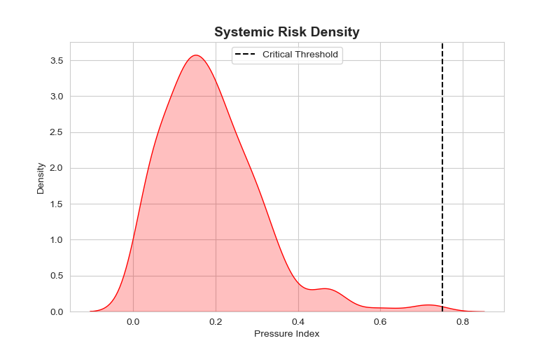
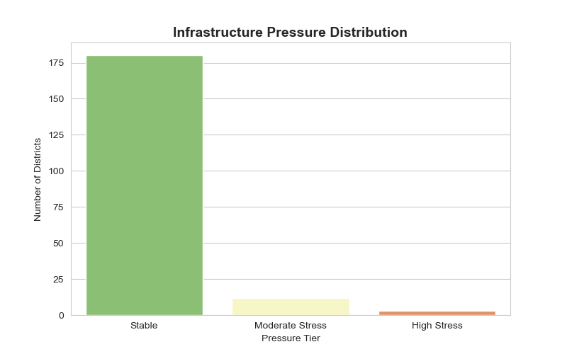
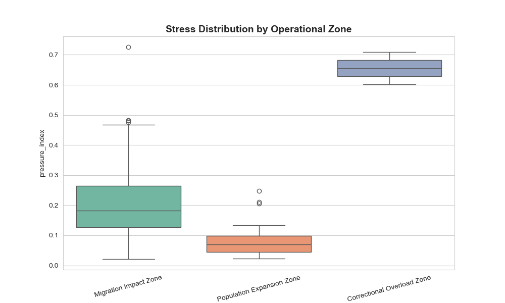

# Government Intelligence Brief: Aadhaar Service Demand Intelligence system

## Executive Summary
This brief outlines the deployment of the **Aadhaar Service Demand Intelligence & Infrastructure Pressure Index**, a predictive governance system designed to transition UIDAI district-level planning from reactive crisis management to proactive infrastructure allocation. By analyzing granular service demand patterns (Enrollment vs. Biometric vs. Demographic), this system identifies high-pressure zones before service delivery failure occurs, ensuring business continuity and citizen satisfaction.

## 1. The Strategic Pivot: From Reactive to Predictive
**Current Status**: District infrastructure planning often relies on historical averages or reacts only after crowding and operator stress become visible. This leads to:
- **Service Denial**: Long wait times during seasonal spikes (e.g., school admission cycles).
- **Resource Misallocation**: Biometric machines deployed in areas needing demographic update operators.

**The Solution**: This system utilizes a **Pressure Index** and **Operational Typology** to quantify stress and categorize demand *type* in real-time. It enables decision-makers to distinguish between a "School-linked Surge" (needing camps) and a "Migration Impact" (needing permanent biometric infrastructure).

## 2. Infrastructure Risk & Service Continuity
Failure to adopt this predictive framework poses significant risks:
- **Critical Infrastructure Stress**: Districts with a Pressure Index ≥ 0.75 are at imminent risk of operational collapse due to volume overriding capacity.
- **Hidden Biometric Maintenance Burden**: Areas with high Biometric Ratios (>60%) often mask underlying equipment degradation. Our **Dominance Score** exposes these hidden maintenance heavy zones.
- **Migrant Workforce Churn**: High volatility combined with adult dominance indicates migrant corridors. Without mobile units, these populations face service exclusion.

## 3. System Capabilities & Policy Intelligence
The system delivers actionable intelligence through three core engines, visualized below:

### A. The Crisis Quadrant
*Identifies critical timebombs by intersecting Volume and Growth Rate.*


### B. Typology Matrix
*Justifies resource allocation by segregating demand sources (School vs Correction).*


### C. Risk Density & Pressure Distribution
*Quantifies the systemic risk across the entire state.*
````carousel

<!-- slide -->

````

### D. Operational Typology Stress
*Shows that Migration zones face the highest variability stress.*


| Intelligence Engine | Output | Operational Meaning |
|---------------------|--------|---------------------|
| **Demand Decomposition** | **Dominance Score** | Identifies if a district is an "Onboarding Zone" (New enrollments) or "Maintenance Zone" (Updates). |
| **Pressure Index** | **Stress Tier** | Quantifies aggregate load (Volume + Growth + Volatility) to flag "Critical" districts. |
| **Operational Typology** | **Zone Classification** | Categorizes districts into actionable types: *School-linked Surge*, *Correctional Overload*, *Migration Impact*. |

## 4. Policy Recommendations (Sample)
Based on the **Policy Intelligence Table** (Notebook 06 Output) and **Action Allocation Matrix**:


- **Scenario A**: *School-linked Surge Zone* (High Child Ratio + High Pressure)
    - **Action**: **Launch school-based biometric drives**.
    - **Rationale**: De-congest permanent centers by offloading child enrollments to temporary school camps.

- **Scenario B**: *Correctional Overload Zone* (Adult Dominant + High Pressure)
    - **Action**: **Set up temporary camps / Shift timings**.
    - **Rationale**: High volume of demographic updates requires maximizing operator throughput for existing citizens.

- **Scenario C**: *Migration Impact Zone* (Biometric Dominant + High Volatility)
    - **Action**: **Deploy mobile enrollment vans**.
    - **Rationale**: fluctuating migrant populations arguably cannot reach static centers; service must go to them.
    - *Evidence*: See **Volatility Pulse** below identifying migration corridors.
    


## 5. National Scalability
This system is architected for immediate national scale:
- **District Agnostic**: The normalization logic works across any administrative unit (District, Block, or State).
- **Data Minimalist**: Requires only monthly service volume aggregates—data already available in UIDAI logs.
- **Policy Grade**: Outputs are not raw numbers but "Decision Ready" classifications (e.g., *Critical Stress*, *Deploy Vans*).

## Conclusion
The **Aadhaar Service Demand Intelligence** system represents a fundamental upgrade to district governance. By quantifying pressure and decoding demand types, UIDAI can optimize resource deployment, reduce citizen wait times, and guarantee service continuity across India's diverse demographic landscape.
